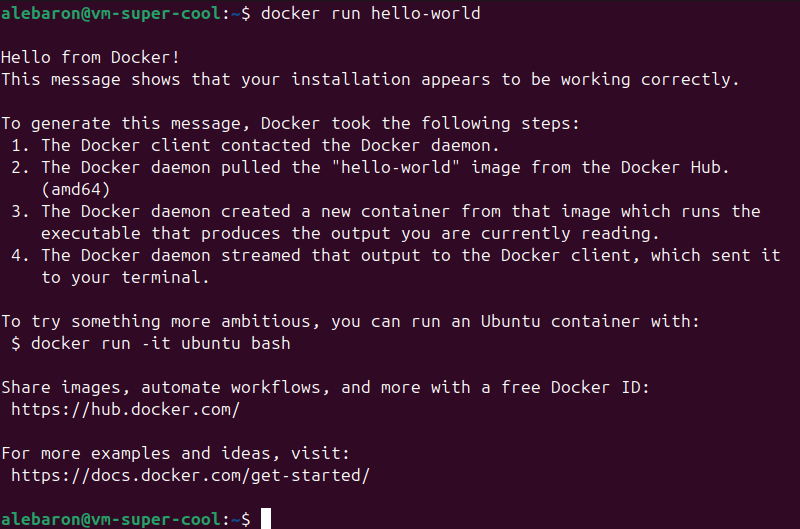

# Débuter Inception

Pour ce projet, vous aurez besoin d'installer **Docker** sur une **machine virtuelle**. Je ne détaillerai pas cette partie-ci dans mon guide. Sachez que pour ma part, je serais sur **Ubuntu** pour réaliser ce projet.

Voici un [lien]((https://www.numetopia.fr/comment-installer-ubuntu-dans-virtualbox/)) vers un guide pour installer Ubuntu à partir de VirutalBox.

## Installer docker sur Ubuntu

Je détaillerai surtout les lignes de commandes à entrer pour installer docker. Si vous souhaitez plus d'informations, n'hésitez pas à vous rendrez sur le site de la [documentation docker](https://docs.docker.com/engine/install/ubuntu/) pour en savoir plus.

### 1. Nettoyer toutes les dépendances conflictuelles

Il se peut qu'en ayant installer votre distribution de linux certains packages nécessaires à docker aient été installé par défaut. Cependant, ceux-ci ne sont peut-être pas officiel ce qui pourrait poser problème pour l'installation future.

Voici la commande pour nettoyer ces indésirables :
```bash
sudo apt remove $(dpkg --get-selections docker.io docker-compose docker-compose-v2 docker-doc podman-docker containerd runc | cut -f1)
```

### 2. Mettre à jour les sources d'apt

Étant donné que nous allons chercher à installer docker via les sources officielles de celui, nous allons devoir les ajouter aux chemins déjà présents dans la configuration de notre apt.

```bash
# Add Docker's official GPG key:
sudo apt update
sudo apt install ca-certificates curl
sudo install -m 0755 -d /etc/apt/keyrings
sudo curl -fsSL https://download.docker.com/linux/ubuntu/gpg -o /etc/apt/keyrings/docker.asc
sudo chmod a+r /etc/apt/keyrings/docker.asc

# Add the repository to Apt sources:
sudo tee /etc/apt/sources.list.d/docker.sources <<EOF
Types: deb
URIs: https://download.docker.com/linux/ubuntu
Suites: $(. /etc/os-release && echo "${UBUNTU_CODENAME:-$VERSION_CODENAME}")
Components: stable
Architectures: $(dpkg --print-architecture)
Signed-By: /etc/apt/keyrings/docker.asc
EOF

sudo apt update
```

### 3. Installer Docker

Pour **installer Docker**, vous pouvez utiliser la commande suivante :
```bash
sudo apt install docker-ce docker-ce-cli containerd.io docker-buildx-plugin docker-compose-plugin
```

Une fois cette installation faite, vous pouvez vérifier que **Docker fonctionne** en fond sur votre machine avec la commande suivante :
```bash
sudo systemctl status docker
```

Et s'il n'est pas démarré, vous pouvez toujours l'allumé vous-même avec cette commande :
```bash
sudo systemctl start docker
```

Enfin, afin de tester que Docker fonctionne bien, vous pouvez tester l'image d'essai avec la commande suivante :
```bash
sudo docker run hello-world
```

Cela devrait vous donner le résultat suivant :


### 4. Ajouter son utilisateur dans le groupe Docker

Devoir taper **sudo** et son mot de passe à chaque nouvelle utilisation de Docker dans un nouveau terminal peut-être un peu énervant. Mais en ajoutant un utilisateur dans le groupe linux Docker, vous n'aurez plus besoin de demander les permissions admin à chaque fois. Voici comment procéder :

Créer le groupe Docker (Normalement il existe déjà) :
```bash
sudo addgroup docker
```

Ajouter un utilisateur au groupe docker :
```bash
sudo usermod -aG docker $USER
```

Vous pouvez tester si cela fonctionne en relançant l'image hello world avec la commande sans le sudo cette fois-ci :
```bash
docker run hello-world
```

## Suite du guide

Si vous en avez fini avec cette partie, rendez-vous dans la partie suivante : [Mise en place du conteneur](./configuration.md).

## Ressources

- [Comment installer Ubuntu dans Virtualbox](https://www.numetopia.fr/comment-installer-ubuntu-dans-virtualbox/)
- [Install Docker Engine on Ubuntu](https://docs.docker.com/engine/install/ubuntu/)