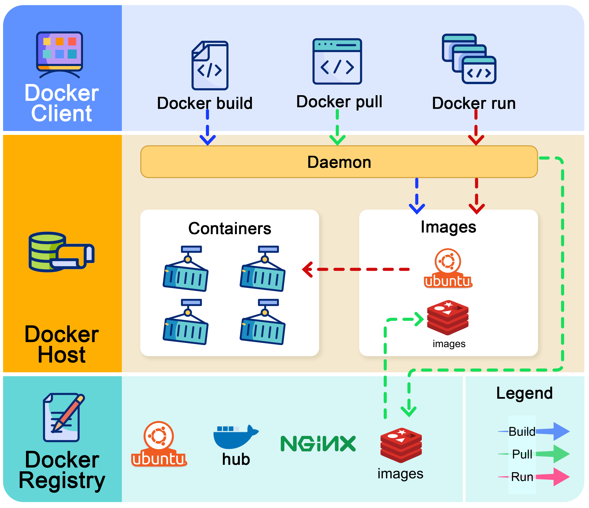

# Introduction à Docker

Cette partie est consacrée à l'initiation à Docker et à la compréhension de ses différents composants et commandes. Je n'irai pas aussi loin dans mes explications que certains blogs qui m'ont servi à l'écrire. Au besoin, toutes mes ressources peuvent être retrouvées à la fin de ce README.

## Qu'est-ce que Docker ?

Lancée en 2013, Docker est une plateforme de conteneurisation **open-source** qui permet aux développeurs d'empaqueter leurs applications ainsi que leurs dépendances dans des conteneurs légers et portables. Docker propose ainsi une solution simple pour créer des environnements isolés tout en garantissant leur bon fonctionnement sur différents OS.

## Images et conteneurs

### Les conteneurs

Un conteneur Docker est un environnement d’exécution léger qui isole une application avec son code, ses bibliothèques, ses dépendances et ses configurations, le tout en partageant le noyau du système d’exploitation de la machine hôte. Contrairement aux machines virtuelles, qui embarquent un système d’exploitation complet, les conteneurs se limitent aux éléments strictement nécessaires, ce qui les rend bien plus légers (en mégaoctets) et rapides à démarrer. Grâce aux mécanismes d’isolation des processus (comme les espaces de noms et les groupes de contrôle du noyau Linux), chaque conteneur fonctionne de manière autonome, comme une machine distincte, tout en optimisant l’utilisation des ressources du serveur.

### Les images

Une image Docker est un modèle immuable et en lecture seule qui contient tout ce qui est nécessaire pour exécuter une application : système de fichiers, code source, bibliothèques, dépendances, variables d’environnement et configurations. Construite à partir d’un Dockerfile, elle est organisée en couches superposées, chaque instruction du Dockerfile créant une nouvelle couche. Ce système permet de réutiliser les couches communes entre plusieurs images, optimisant ainsi l’espace de stockage et accélérant la construction et le téléchargement. Les images sont identifiées par des tags (comme nginx:latest ou ubuntu:20.04), ce qui permet de spécifier précisément la version à déployer. En résumé, l’image Docker agit comme un plan détaillé pour créer un conteneur, garantissant un environnement cohérent et reproductible.

### Quelles différences entre image et conteneur ?

Une **image** Docker est comme le plan détaillé d’une maison : elle décrit exactement comment construire l’environnement. Ce plan est immuable, partagé et réutilisable à l’infini.

Le **conteneur**, lui, c’est la maison construite à partir de ce plan : un espace vivant où l’application "vit" et s’exécute. Tu peux en créer plusieurs à partir du même plan (image), les modifier, les démolir ou les recréer à volonté. Sans le plan (image), pas de maison (conteneur) — mais une fois construite, la maison fonctionne de manière autonome, isolée des autres.

## Comment fonctionne Docker ?

## Ressources

### Blog

- [Qu’est-ce que Docker ? Notre guide complet](https://about.gitlab.com/fr-fr/blog/what-is-docker-comprehensive-guide/)
- [Qu’est-ce que Docker ?](https://www.ibm.com/fr-fr/think/topics/docker#:~:text=Docker%20est%20une%20plateforme%20open,jour%20et%20g%C3%A9rer%20des%20conteneurs.)
- [Docker : qu’est-ce que c’est et comment l’utiliser ?](https://liora.io/docker-guide-complet)
- [Image Docker vs conteneur : explication des principales différences](https://www.hostinger.com/fr/tutoriels/image-docker-vs-conteneur/)
- [Commandes Docker essentielles : le guide CLI complet](https://blog.stephane-robert.info/docs/conteneurs/moteurs-conteneurs/docker/cli/)

### Autres Inception

- [Inception d'Azedineouhadou](https://github.com/azedineouhadou/inception-42#description)